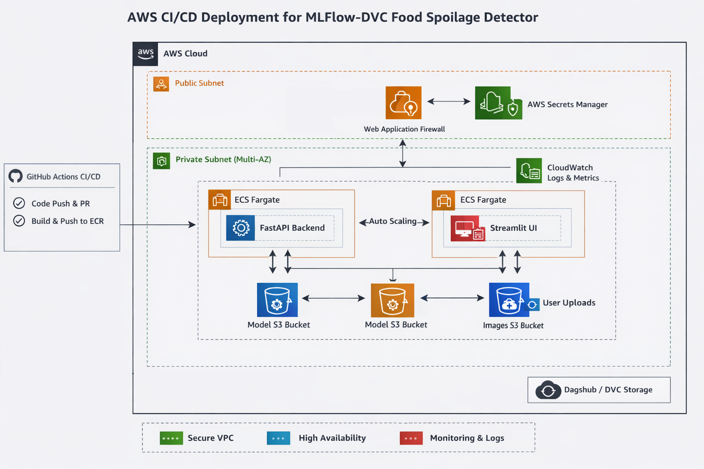
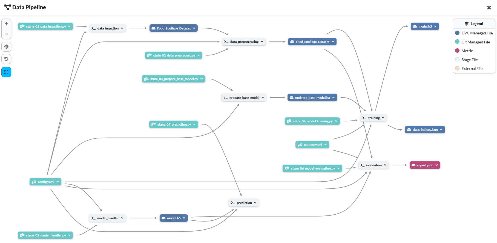
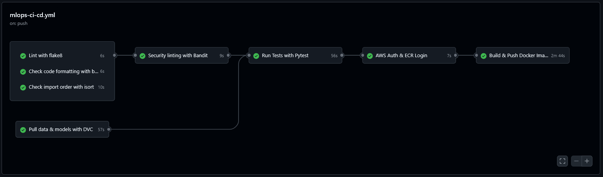
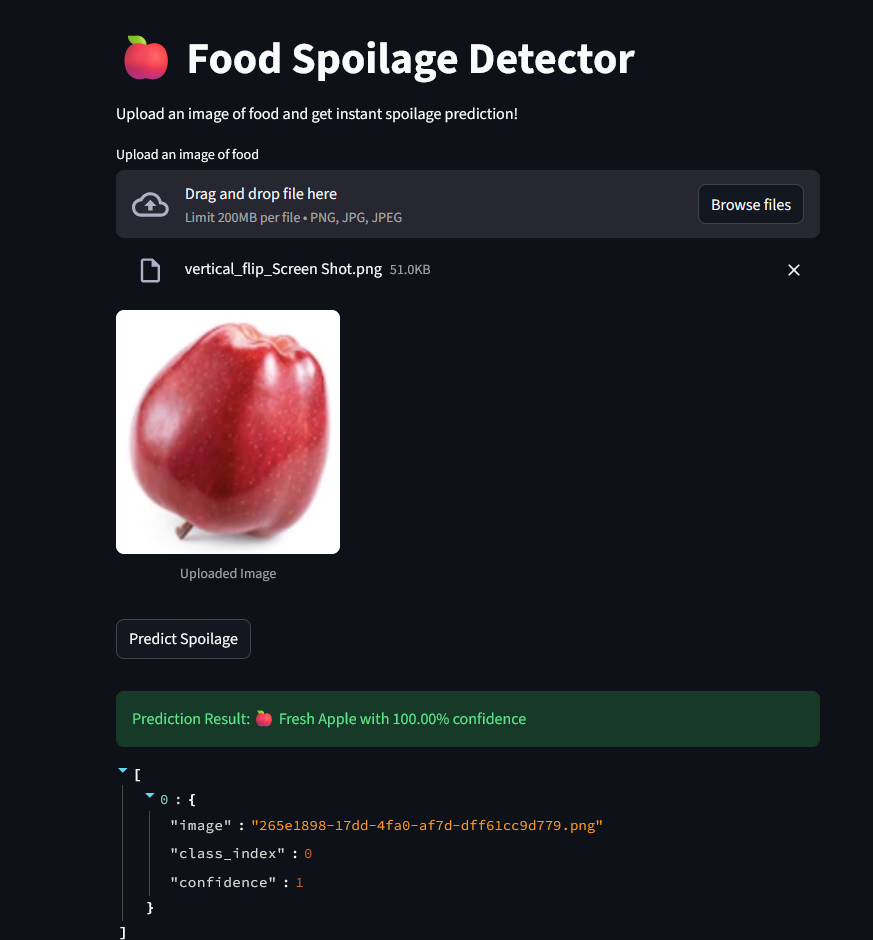

# 🍎 Food Spoilage Detector — End-to-End MLOps at Scale

<p align="center">


</p>


---

## 🌱 Project Overview

**Food Spoilage Detector** is a **production‑grade AI/ML system** designed to detect food spoilage early in the agricultural supply chain using **computer vision, MLOps best practices, and cloud‑native deployment**.

The goal of this project is to create **impactful, scalable AI solutions** that help re‑imagine food systems—making them **smarter, more sustainable, and more resilient**, while improving health outcomes across agriculture and downstream communities.

### 📦 The Real‑World Problem

In modern food supply chains, spoilage often goes undetected until products reach supermarkets. This leads to:

* ❌ Large financial losses
* ❌ Inefficient procurement decisions
* ❌ Increased food waste
* ❌ Reduced consumer trust

A simplified supply chain looks like:

**Farmer → Collector → Wholesaler → Distributor → Supermarket**

Supermarkets typically purchase **entire lots of produce** without automated quality validation. Manual inspection is **time‑consuming, costly, and not scalable**, especially given the daily volume of fresh food traded globally.

> In regions such as the U.S., agricultural exports reach **millions of metric tons annually**, making manual quality checks impractical at scale.

### 🎯 Our Solution

This project introduces an **AI‑driven quality inspection system** that enables **Distributors and Supermarkets** to:

* 📸 Capture food images during procurement
* 🤖 Automatically classify food as *fresh* or *spoiled*
* 📊 Make data‑driven purchasing decisions **before bulk buying**
* 🔁 Continuously improve models using production data

The result is a **scalable, automated, and auditable MLOps pipeline** capable of reducing food waste and improving supply‑chain efficiency.

---

## 🧠 Key Design Principles

Inspired by senior‑level software and MLOps practices, this system emphasizes:

* 🛠️ **Maintainability** — clear modular boundaries, configuration‑driven pipelines
* 🔄 **Reproducibility** — full experiment and data lineage via DVC & MLflow
* 🧩 **Scalability** — cloud‑native deployment with containerized services
* 🔐 **Security & Governance** — AWS IAM, Secrets Manager, and CI/CD controls
* 📈 **Observability** — CloudWatch logging and structured metrics

---

## ⚙️ System Capabilities

* 📥 Multi‑source data ingestion (tracked with DVC)
* 🧹 Automated preprocessing pipelines
* 🧠 CNN‑based model training with TensorFlow
* 📊 Experiment tracking with MLflow
* ✅ Model evaluation & validation gates
* 🔁 Model versioning and rollback via S3
* 🌐 FastAPI inference service
* 🖥️ Streamlit‑based UI for real‑time predictions
* ☁️ Fully deployed on AWS ECS Fargate

---

## 🎨 Development & Architectural Style

- **Single-Input Prototype** – Initially designed to process **one image per request** for quick validation of model predictions.
- **Modular & Scalable Architecture** – Built with **OOP principles** and **SOLID design patterns**, allowing seamless extension to **batch or concurrent predictions**.
- **Cloud-Native Production Setup** – Configured for **AWS ECS/Fargate deployment**, **Docker containers**, and **CI/CD pipelines**, enabling high-throughput processing.
- **MLOps Best Practices** – Integrated **DVC** and **MLflow** for **reproducibility, tracking, and pipeline management**, ensuring robust, production-ready workflows.

---

## 🏗️ High‑Level Architecture

> 📌 **Detailed AWS architecture and design decisions are documented separately.**

<p align="center">
  
</p>

➡️ **See:** [`aws_readme/aws_architecture.md`](aws_readme/aws_architecture.md)

### Architecture Highlights

* **Training & Experiments**: Local / CI environments with DVC + MLflow
* **Artifact Storage**: Amazon S3 (datasets, models, production artifacts)
* **Model Serving**: FastAPI container on ECS Fargate
* **User Interface**: Streamlit container on ECS Fargate
* **Traffic Management**: Application Load Balancer (ALB)
* **Logging & Monitoring**: AWS CloudWatch

---

## 🔁 MLOps Lifecycle & Pipelinea

This project follows a **fully reproducible, stage‑driven MLOps workflow**:

1. **Data Ingestion** — load datasets from external sources
2. **Data Versioning** — track raw & processed data using DVC
3. **Preprocessing** — normalize, clean, and structure image data
4. **Base Model Preparation** — initialize and fine‑tune CNN backbone
5. **Model Training** — train models with configurable parameters
6. **Experiment Tracking** — log metrics, artifacts, and parameters in MLflow
7. **Model Evaluation** — validate generalization performance
8. **Model Handling** — promote best model to production
9. **Deployment** — serve via FastAPI + Streamlit on AWS
10. **Feedback Loop** — store production images for continuous improvement

---

## 📦 DVC Pipeline Overview

```yaml
stages:
  data_ingestion:
    cmd: python src/pipeline/stage_01_data_ingestion.py
  data_preprocessing:
    cmd: python src/pipeline/state_02_data_preprocess.py
  prepare_base_model:
    cmd: python src/pipeline/state_03_prepare_base_model.py
  training:
    cmd: python src/pipeline/state_04_model_training.py
  model_handler:
    cmd: python src/pipeline/stage_05_model_handler.py
  evaluation:
    cmd: python src/pipeline/stage_06_model_evaluation.py
  prediction:
    cmd: python src/pipeline/stage_07_prediction.py
```

Each stage is **fully reproducible and dependency‑aware**, enabling safe experimentation and CI automation.


<p align="center">
  
</p>


---

## 🚀 CI/CD Pipeline

This repository implements a **robust GitHub Actions pipeline**:

* ✅ Code quality checks (Flake8, Black, Isort)
* 🔐 Security scanning (Bandit)
* 📦 DVC data & model pull
* 🧪 Automated testing with Pytest
* ☁️ AWS authentication & ECR login
* 🐳 Docker image build & push
* 🚀 Production deployment trigger on `master`

This ensures **production readiness on every merge**.

<p align="center">
  
</p>

---

## ☁️ AWS Services Used

| Purpose              | Service                   |
| -------------------- | ------------------------- |
| Container Registry   | Amazon ECR                |
| CI/CD                | GitHub Actions            |
| Model & Data Storage | Amazon S3                 |
| Secrets Management   | GitHub                    | 
| Logging              | Amazon CloudWatch         |
| Load Balancing       | Application Load Balancer |
| Compute              | ECS Fargate               |
| DVC Remote           | DagsHub / S3              |

---

## 🗂️ Project Structure

```bash
mlflow-dvc-food-spoilage-detector/
├── src/                 # Core ML & pipeline logic
├── config/              # Configuration files
├── data/                # DVC‑tracked datasets
├── artifacts/           # Pipeline outputs
├── models/              # Versioned models
├── aws_readme/          # AWS architecture docs
├── templates/           # Streamlit UI
├── tests/               # Automated tests
├── app.py               # FastAPI backend
├── Dockerfile*          # Container definitions
├── dvc.yaml             # DVC pipeline
├── params.yaml          # Training parameters
└── README.md            # Project documentation
```

---

## UI Stage Previews

- 🖥️ Streamlit UI Stage 1 Preview

<p align="left">
  
</p>

---

## 🧭 Future Enhancements

* 📊 Advanced model monitoring & drift detection
* 🧠 Multi‑class spoilage classification
* 🌍 Multi‑region deployment
* 🔄 Automated retraining pipelines
* 📱 Mobile‑friendly UI

---

## 🤝 Contributing

* Fork the repository
* Create a feature branch
* Commit changes with clear messages
* Open a Pull Request

All contributions related to **ML, MLOps, Cloud, or Documentation** are welcome.

---

## 💡 Vision

> This project demonstrates how **AI + MLOps + Cloud** can be combined to solve real‑world agricultural problems at scale—bridging the gap between experimentation and production‑grade systems.
