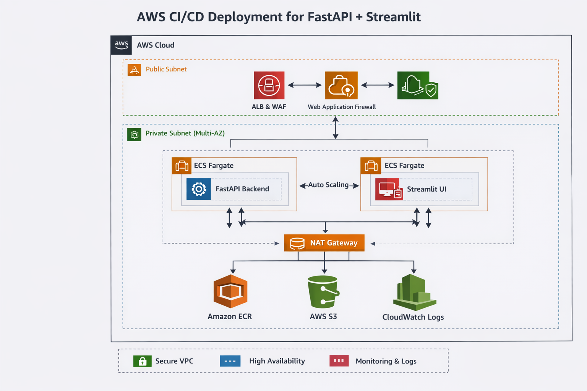

# 🚀 AWS Architecture & Deployment Guide  

## MLOps – FastAPI + Streamlit on ECS Fargate

This repository documents the **architecture, networking, security, and deployment strategy** used to run a **production-ready MLOps application** on **AWS ECS Fargate**, fronted by an **Application Load Balancer (ALB)**.

The system deploys **two containerized services** (FastAPI + Streamlit) securely, scalably, and cost-efficiently using modern AWS best practices.

---

## 🧠 Project Overview

This project deploys **two independent containerized applications**:

| Service     | Purpose                         | Port |
|------------|----------------------------------|------|
| FastAPI    | ML inference API (`/api/predict`) | 8000 |
| Streamlit  | User-facing web UI                | 8501 |

Both services:
- Run on **AWS ECS (Fargate)**
- Live inside **private subnets**
- Are exposed externally **only via a single Application Load Balancer**

---

## 🗺️ High-Level Architecture

  

1. One ALB  
2. Two backend services  
3. Path-based routing
4. Internet Gateway (IGW)
5. NAT Gateway (Outbound Internet Access)
6. Security Groups (Zero-Trust Model)

---

## 🧩 Why This Architecture?

✅ **Secure** – No public IPs for containers  
✅ **Scalable** – ECS Services + ALB health checks  
✅ **Cost-efficient** – Serverless containers (Fargate)  
✅ **Production-grade** – IAM roles, isolated networking, zero secrets in code  

---

## 🌐 Networking Architecture (VPC)

### 1️⃣ Virtual Private Cloud (VPC)
- **CIDR:** `10.0.0.0/16`
- Isolates all AWS resources in a private network

---

### 2️⃣ Public Subnets (ALB lives here)

| Subnet | AZ | CIDR |
|------|----|------|
| public-subnet-1 | ap-south-1a | 10.0.1.0/24 |
| public-subnet-2 | ap-south-1b | 10.0.2.0/24 |

✔ Auto-assign public IPv4: **ON**  
✔ Route table → **Internet Gateway**

**Why?**  
The Application Load Balancer must be reachable from the internet.

---

### 3️⃣ Private Subnets (ECS Tasks live here)

| Subnet | AZ | CIDR |
|------|----|------|
| private-subnet-1 | ap-south-1a | 10.0.11.0/24 |
| private-subnet-2 | ap-south-1b | 10.0.12.0/24 |

✔ Auto-assign public IPv4: **OFF**  
✔ Route table → **NAT Gateway**

**Why?**  
Application containers should never be exposed directly to the internet.

---

### 4️⃣ Internet Gateway (IGW)
- Name: `mlops-igw`
- Attached to the VPC
- Used **only by public subnets**

---

### 5️⃣ NAT Gateway (Outbound Internet Access)
- Deployed in a **public subnet**
- Uses an **Elastic IP**
- Enables ECS tasks in private subnets to:
  - Pull Docker images
  - Access S3
  - Send logs to CloudWatch

---

## 🔐 Security Groups (Zero-Trust Model)

### ALB Security Group (`ALB-SG`)

| Type | Port | Source |
|----|----|------|
| HTTP | 80 | 0.0.0.0/0 |
| HTTPS | 443 | 0.0.0.0/0 |

✔ Internet-facing  
✔ Only public entry point  

---

### ECS App Security Group (`ECS-App-SG`)

| Type | Port | Source |
|----|----|------|
| Custom TCP | 8000 | ALB-SG |
| Custom TCP | 8501 | ALB-SG |

🚫 No public inbound access  
🚫 No `0.0.0.0/0` rules  

**Only the ALB can talk to ECS containers**

---

## ⚖️ Application Load Balancer (ALB)

- Deployed in **public subnets**
- Uses `ALB-SG`
- Routes traffic using **path-based routing**

---

### 🎯 Target Groups

#### FastAPI Target Group
- Name: `tg-mlops-fastapi`
- Target type: **IP**
- Port: **8000**
- Health check: `/health`

#### Streamlit Target Group
- Name: `tg-mlops-streamlit`
- Target type: **IP**
- Port: **8501**
- Health check: `/`

---

### 🔁 Listener Rules

- ALB always needs a default action. This is the target group used when no rules match.
- Condition: Path is /api/\*
    - Action: Forward to <code>tg-mlops-fastapi</code>
- Any other path
    - Any other path: Forward to <code>tg-mlops-streamlit</code>

| Path | Action |
|----|------|
| `/api/*` | Forward → FastAPI Target Group |
| `/` | Forward → Streamlit Target Group |

👉 **One ALB, two applications**

---

## 🐳 ECS Architecture

### ECS Cluster
- Launch type: **Fargate**
- Name: `mlops-cluster`
- No EC2 instances required
- Launch two separate services for Target Group <code>tg-mlops-fastapi</code> and <code>tg-mlops-streamlit</code>

---

### Task Definitions (IMPORTANT)

We use **TWO separate task definitions**:

| Task Definition | Reason |
|---------------|-------|
| FastAPI Task | Different port, image, env vars |
| Streamlit Task | Different UI, env vars |

Each task definition includes:
- Docker image
- Container port
- IAM task role
- Environment variables

---

### ECS Services

| Service | Purpose |
|------|--------|
| FastAPI Service | Keeps API running |
| Streamlit Service | Keeps UI running |

✅ ECS Services register targets with ALB  

---

## 🔐 IAM Roles

### ❌ What We Did NOT Do
- No `.env` files inside Docker images
- No `AWS_ACCESS_KEY_ID` in ECS
- No hardcoded secrets

---

### ✅ What We Did
We used **IAM Task Roles**:

✔ Secure  
✔ Automatically rotated  
✔ No secret leakage  

---

## 🌍 Environment Variables

### Streamlit → FastAPI Communication

<code>API_URL=http://<ALB_DNS>/api/predict </code>

✔ Streamlit never calls FastAPI by container name  
✔ Always communicates via ALB DNS  

---

## 🧪 Final Result

| URL | Result |
|----|------|
| `http://<ALB_DNS>/` | Streamlit UI |
| `http://<ALB_DNS>/api/predict` | FastAPI API |

✔ Healthy target groups  
✔ Secure networking  
✔ Production-ready deployment  

---

